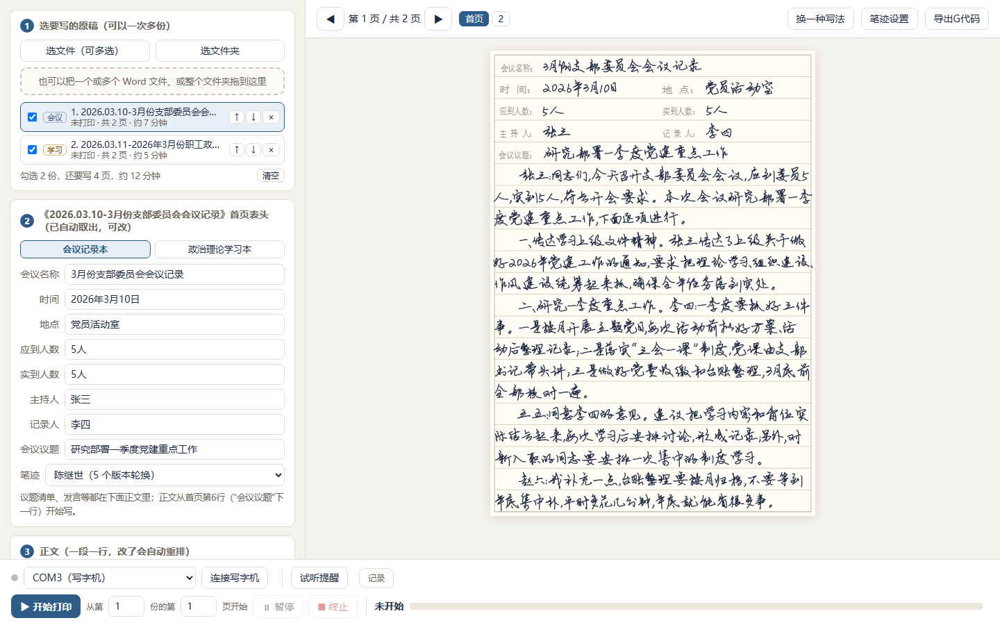
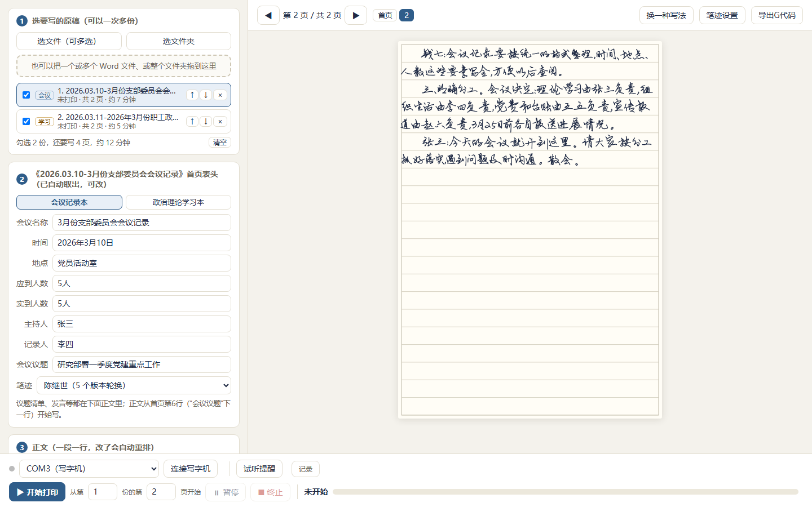

# 写字机打印

把 Word 写好的会议记录、政治理论学习记录，一键交给写字机写成手写字。

首页按记录本上印好的表格填栏目，正文从首页横线区接着写，写满自动续到下一页；可以一次排好多份，连着写完。
写字机是 GRBL 固件的笔式写字机（"奎享雕刻"能驱动的那一类），程序直接通过 USB 串口驱动，不用再开奎享。



## 能做什么

- **一份原稿一键写完**：自动从 Word 里取出会议名称、时间、地点、人数、主持人、记录人、议题，填进首页表格；正文接着写，续页自动换。
- **多份排队**：选一个文件夹，自动挑出会议记录、活动记录、研讨记录、政治理论学习计划（含讨论），按会议日期排好。
  队列和每份写到第几页都存着，关掉程序再开还在，没写完的下次直接接着写。
- **更像手写**：同一个人的 5 个版本字库轮换，重复出现的字写法不一样；相邻几个字一起微微起伏，大小、倾斜缓慢变化。
- **像 Word 一样排版**：标点不出现在行首，开括号、开引号不落在行尾，数字字母不拆到两行；破折号写成一笔长横。
- **排版固定**：同一份文件每次导入，排出来一字不差。今天写前几页、明天重新打开写后几页，能严丝合缝接上。
- **换纸语音提醒**：纸两面都写。写完一页"叮咚"一声：下一页是偶数页，念"本页已打完，请您翻页"（写在这一张的背面）；
  是奇数页，念"本页已打完，请您更换空白页"。任务栏按钮同时闪烁；没人理，每 3 分钟再提醒一次，最多 3 次。
  一份写完、换本子、全部写完、写字机出错，各有一句。
- **点"开始打印"直接开写**，不用再确认；只有原稿里有会把纸写坏的问题（空着的栏目、写不下的表头、字库里没有的字）才拦一下，说清是哪里。
- **随时暂停、终止，从任意一份的任意一页接着写**。
- **没有写字机也能试**：端口选"模拟写字机"，整个流程照走，只是不真写。
- **导出 G 代码**：每页存成一个 .nc 文件，也可以拿到奎享雕刻里写。



## 需要什么

- **Windows 10 / 11**。界面用系统自带的 WebView2（Windows 11 自带；Windows 10 装了新版 Edge 一般也有）。
- **Python 3.12**（作者用的版本）。
- **写字机**：GRBL 固件、USB 串口、Z 轴步进电机抬落笔。作者的是 Grbl 1.3a（ESP32 主板），波特率 115200。
- **奎享雕刻**（建议装）：第一次运行时程序从它的设置里读抬笔落笔高度、速度等参数；字库也从它的"在线字库"下载。
- **字库**：陈继世、真迹两套手写单线字库，是别人的作品，本仓库不附带，下载方法见 [fonts/字库说明.txt](fonts/字库说明.txt)。

## 安装

1. 安装 [Python 3.12](https://www.python.org/downloads/)，安装时勾选"Add python.exe to PATH"。
2. 下载本仓库（页面上绿色的 Code 按钮 → Download ZIP），解压到一个固定的位置。
3. 双击 **安装.bat**：自动建运行环境、装依赖（用清华镜像），并在开始菜单建"写字机打印"。
4. 准备字库：照 [fonts/字库说明.txt](fonts/字库说明.txt) 下载，放进 fonts 文件夹（或留在奎享的字库目录里），不用改名。
5. 开始菜单打开"写字机打印"。先用 [示例/3月份会议](示例/3月份会议) 里的两份示例原稿、端口选"模拟写字机"走一遍。

## 使用

1. **选原稿**：点"选文件（可多选）""选文件夹"，或者直接把文件、文件夹拖进左上角的框。
   左边列表就是写字的顺序：勾选的才写；↑↓ 调顺序，× 移出。每份下面一行是打印情况（未打印 / 已打印几页 / 已打完）。
   如果把每月要写的文件放在 OneDrive（或文档、桌面）下名为"写字机手抄队列"的文件夹里、按月分子文件夹，"选文件夹"会直接从这里打开。
2. **核对**：左边是首页表头各栏和正文，可以直接改，改完自动重排；右边逐页预览，灰色字是本子上印好的栏目，只作对照、不会写。
3. **连接写字机**：左下角选端口（没有写字机就选"模拟写字机"），点"连接写字机"。奎享雕刻开着的话，先在它那里点"断开"，两个程序不能同时连。
4. **对笔**：固定好纸和笔，用手把笔推到首页表格的左上角。规则只有一条：**开写时笔尖在哪，哪就是这一页的左上角**。
5. **开始打印**：点了就开写。写完一页，笔抬起回到左上角，语音提醒"翻页"（下一页写在背面）或"更换空白页"；弄好后点"继续"。
   换纸时纸放的位置不变，就不用再对笔；翻页后横线区的左上角要是不在笔尖下，用手把笔推过去再继续。换纸时点"不写了"直接停，不再追问。
6. **暂停**：写完当前这一笔就停。**终止**：写到一半时会先问一句（免得误点废一页），确定后约半秒内停下、抬笔、回到这一页的左上角；
   底下"从第几份的第几页开始"会停在这一页，再点"开始打印"就接着写。

## 原稿格式

会议记录（活动记录、研讨记录同样）：

```
第 1 段        会议名称（就是首页"会议名称"一栏）
时间：……      地点：……
应到：……      实到：……
主持人：……    记录人：……
会议议题：……
其余每段都是正文（一段一行）
```

同一行的两栏之间用 Tab 或两个以上空格隔开。列席人员、活动主题这类表头以外的内容，都当正文写。

政治理论学习计划（含讨论）：第 1 段是标题（不写），其余是正文。学习时间取文件名里的日期
（如"2.2026.03.11-……"写成"2026年3月11日"）；地点、主持人、人数、缺席这些原稿里没有，在程序里填，之后按上次的值带出，开印前核对单会列出来请你核对。

程序按文件名挑文件：含"会议记录""活动记录""研讨记录"，或含"政治理论学习"又含"讨论""记录"的 .docx；口播稿等其他文件自动跳过。

## 换成自己的记录本

首页表格各栏的位置是按作者用的"会议记录本""政治理论学习记录本"量的，在 [hwprint/forms.py](hwprint/forms.py)：
页宽、行数、行距，以及每一栏从哪里开始写、写到哪里（毫米，从表格左上角量）。用尺子量自己的本子，改这里的数字，在预览里对照就行。
表头以外的正文区只用到页宽、行数和行距。

## 踩过的坑

真机上一页页试写出来的问题，照"现象 → 原因 → 怎么解决的"记下来，换别的机器、别的字库时可以少走弯路。

1. **写着写着成段缺字，有的字缺笔画**
   原因：Windows 上用 pyserial 的 `read(256)` 读串口，要凑满 256 个字节或等满超时才返回，写字机回的"ok"被攒成一批，
   程序发指令跟不上，写字机缓冲区空了就停下；停够 25 毫秒电机断电，抬落笔对不上（机械上这一环是推测）。
   解决：改成"有多少读多少"，每秒能送的指令从 64 行升到 400 多行；按固件报的缓冲区大小控制在途的字节数。
   每页写完日志里记一句"中途没有停顿"或"中途停顿 N 次"，出现停顿就说明指令没跟上。
2. **字比奎享写的低 2 毫米，横线从字的下部穿过**
   原因：奎享的"笔记"模式把字放在一行里大致居中，不是贴着下面的横线。
   解决：字的基线放在行高的 79% 处（`config.BASE_LINE`），和奎享一致。
3. **写起来"点点点"地响，还慢**
   原因：作者名为"老宫"的那版陈继世，字是碎笔画拼的，常用字平均每字落笔约 12 次，其他版本约 3 次。
   解决：删掉这版。挑字库要先统计每个字的落笔次数和碎笔画，光看字样看不出来。
4. **想写快一点，只调写字速度几乎没用**
   原因：时间主要花在加速和转弯上。
   解决：连接时把写字机的加速度（`$120`、`$121`）从 3000 调到 5000，转弯参数（`$11`）从 0.01 调到 0.02；写字 5000、空走 12000 毫米/分。
   这几项存在写字机里，奎享写字也会跟着变快。原值记在 设置.json 的 `tune_original`，要改回就把 `machine.tune` 改成原值再连一次。
5. **两笔之间"只抬一点笔"想省时间，结果整页拖线**
   原因：按估计的"笔尖离纸 5 毫米"只抬到一半，笔根本没离开纸。
   解决：撤回，两笔之间照旧抬满。抬笔高度这类一错就毁掉整页的参数，不能凭目测估，要先在废纸上试。
6. **连接后马上点开始打印，写字机乱了**
   原因：ESP32 版的 GRBL 打开串口时不复位、也不报启动信息，原来程序干等 6 秒，这期间就当已经连上了。
   解决：连接的每一步都做完才算连上，连接中不许开始打印；0.5 秒没有回音就主动发"?"问状态。
7. **方向键、抬笔落笔、走一圈边框这些按钮用不上**
   原因：实际的做法是用手把笔推到纸角（写字机空闲时电机不通电，可以手推），按钮反而多一道操作。
   解决：都删了，只留一条规则：开写时笔尖在哪，哪就是这一页的左上角。
8. **偶尔半行字一起往下沉**
   原因：手写起伏的上下幅度偏大，相邻几个字又是一起慢慢变的；字变大时原来以字的顶边为准往下长，也会整体下沉。
   按 116 页统计，约四分之一的页有连着 8 个字一起偏下 0.7 毫米以上。
   解决：上下起伏减半，字变大变小改以字的中心为准。现在最多约 0.4 毫米；换行和每页写哪些字都没变。
9. **会议名称太长被自动缩小，和别的栏不协调**
   解决：表头一律按原大写，不缩小。写不下的，加入时、队列里、核对单里都会提示"多出约几个字"，改短就行；
   真要照写，多出的字不写，不会写出表格、更不会写到纸外。
10. **下个月的学习记录，带上了上个月的学习时间**
    原因：开印时把表头各栏都存成了下次的默认值，学习时间也在内。
    解决：学习时间不再沿用，改从文件名里的日期取。
11. **任务栏闪烁闪错了窗口**
    原因：资源管理器打开程序文件夹时，那个窗口的标题也叫"写字机打印"。
    解决：按进程找程序自己的窗口。
12. **读奎享字库要不要解密**
    .gfont 文件前面有一段加密的元数据，但字形在后面一个普通的 ZIP 包里。元数据里只有字库名、字号基准，
    程序按常用字的中位高度统一各字库的大小，字号基准正好约掉，所以只读 ZIP 包，不做任何解密。

## 还没解决的问题

- **写完一页、语音提醒之后，界面偶尔点不动**：作者遇到过两次，只能在任务管理器里结束程序，原因没有查实。
  程序加了"卡住自动记录"：界面超过 6 秒没反应，就把当时的状态、各部分停在哪一行记进"日志"文件夹，恢复了再记卡了多久。
  结束程序后重新打开，队列和写到第几页都还在，直接接着写。遇到了欢迎把日志里"界面没有反应"那一段贴到 Issues。
- **提速后，有一页最后几行越往下越低，偏了好几毫米**：推测是纵向电机偶发丢步。
  写完一页别急着换纸，看笔尖是不是准确回到开写时的点，就能判断；确认是丢步的话，把纵向加速度（`$121`）改回 3000。

## 语音提醒的录音

[hwprint/sounds](hwprint/sounds) 里 7 句提示音，用 edge-tts（借用微软 Edge 浏览器的"朗读"功能，声音"云希"）生成，**仅供个人、非商业使用**；
微软没有公开授权再分发这类录音。介意的话删掉，用 [tools/make_voices.py](tools/make_voices.py) 自己生成，
或者换成自己的录音（同名 WAV 文件替换即可）。电脑静音时只剩任务栏闪烁。

## 其他

- **设置**：第一次运行自动生成 设置.json（参数从奎享雕刻读），之后都在这里。
- **日志**："日志"文件夹，按日期存；界面右下角"记录"看最近的操作。
- **排版固定**：随机数种子按文件名定；点"换一种写法"得到的样子会记住。换笔迹、改起伏幅度，排版会整体变，写了一半的份别在中途改。
- **开发和测试**：`devserver.py` 在普通浏览器里跑同一个界面；[hwprint/mockgrbl.py](hwprint/mockgrbl.py) 是模拟写字机；
  `tools/smoke_test.ps1` 隐藏窗口启动一次检查界面和后台是否接通。

## 关于这个项目

作者不会写代码。这个程序是作者提需求、在自己的写字机上一页页试写、拍照反馈问题，
由 [Claude Code](https://claude.com/claude-code)（Anthropic 的 AI 编程助手）编写和测试的，前后两天。
上面"踩过的坑"，就是这两天里真机试写一次次撞出来的。

本项目和奎享没有关系；"奎享雕刻"是奎享的软件，字库归各自的作者。

## 许可证

代码用 [MIT 许可证](LICENSE)：可以免费使用、修改、分发，保留版权声明即可。字库不随仓库分发；提示音的授权见上。
